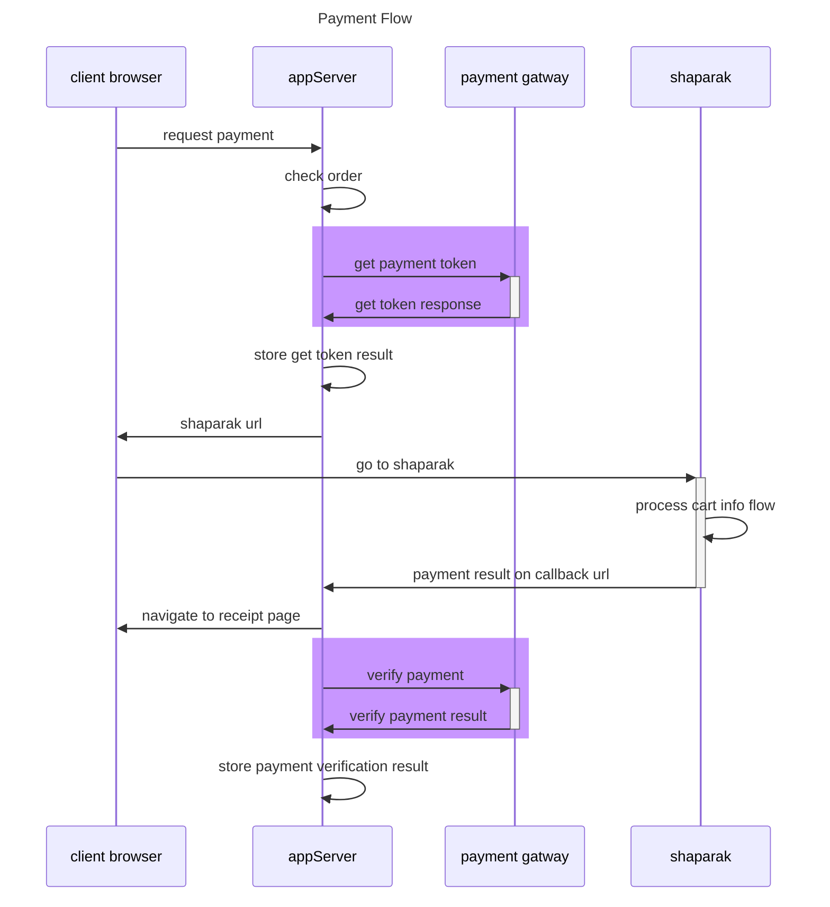

<h1 align="center" style="font-family:'tahoma';" >
🌐 پکیج اتصال به درگاه بانک سامان
</h1>

<div align="center" style="font-family:'tahoma';">
  <strong>
  این ریپوزیتوری امکان اتصال به درگاه بانک سامان را ایجاد میکند.
کدها با زبان جاواسکریپت پیاده سازی شده و برای TypeScript نیز type declaration دارد.
نسخه فعلی پکیج: `2.0.0`
  </strong>
</div>


<div align="center" style="font-family:'tahoma';" >

---
**برای مطالعه ی جزئیات پیاده سازی صفحه مستندات را مشاهده کنید**
[Documents 3.6](https://github.com/heidaryBhnam/sep-payment-gateway/tree/main/documents)

برای تست محلی بدون اتصال به سرویس SEP، شبیه ساز پرداخت را با دستور زیر اجرا کنید. وقتی `isOnDevelop` برابر `true` باشد، gateway به صورت پیش فرض از `http://127.0.0.1:4100` استفاده می کند. مقدار `SEP_BASE_URL` برای انتخاب آدرس دیگری قابل استفاده است:

```bash
npm run simulator
```

راهنمای سناریوهای شبیه ساز در [documents/Simulator.md](documents/Simulator.md) قرار دارد.

---

</div>

<div align="right">

## 👨‍💻 نحوه ی نصب پکیج

</div>


<div align="left">

```js
npm i sep-payment-gateway-next -s
```

</div>


<div align="right">

## 👨‍💻 نحوه ی استفاده از پیکج

</div>

<div align="right">

### ⚙️ تعریف گیتوی سامان

</div>

<div align="left">


```js
require('dotenv').config();

const sepGateway = require('sep-payment-gateway-next')(
    {
        SEP_TERMINAL_ID: process.env.SEP_TERMINAL_ID,
        isOnDevelop: process.env.NODE_ENV !== 'production',
    }
);

console.log(sepGateway);
```

</div>

<div align="right">

### ⚙️ استفاده در پروژه های TypeScript

</div>

<div align="left">

تعریف های TypeScript به صورت خودکار از پکیج دریافت میشوند. برای استفاده از خروجی CommonJS پکیج، آن را به شکل زیر import کنید:

```ts
import createSepPaymentGateway = require('sep-payment-gateway-next');

const sepGateway = createSepPaymentGateway({
    SEP_TERMINAL_ID: process.env.SEP_TERMINAL_ID as string,
    isOnDevelop: process.env.NODE_ENV !== 'production',
});

const invoice = sepGateway.makeInvoice({
    Amount: 1000,
    RedirectURL: 'https://<YOUR_SITE_HOST.IR>/<CALL_BACK_PATH>',
    ResNum: `SEP_TEST_PAYMENT_${Math.floor(Math.random() * 999)}`,
    TxnRandomSessionKey: 'SEP_RANDOM_SESSION_KEY',
});

async function pay(): Promise<void> {
    const payment = await sepGateway.createPayment(invoice);

    payment.getPaymentUrl();
    payment.getPaymentRedirectHTMLPage();

    const verification = await sepGateway.verifyPayment(
        'REFERENCE_NUMBER',
        'SEP_RANDOM_SESSION_KEY',
    );
    console.log(verification.getSuccess());
}

void pay();
```

</div>


<div align="right">

### ⚙️ نحوه ی دریافت توکن

متد دریافت توکن پرداخت از درگاه بانک سامان

</div>


[`sepGateway.createPayment`](sepGateway.createPayment)

<div align="left">

🍰 Sample Cdoe:

```js
try
    {
        const invoice = sepGateway.makeInvoice(
            {
                Amount:1000,
                RedirectURL:'https://<YOUR_SITE_HOST.IR>/<CALL_BACK_PATH>',
                ResNum:`SEP_TEST_PAYMENT_${Math.floor(Math.random() * 999)}`,
            }
        );

        const payment = await sepGateway.createPayment(invoice);

        // Continue the process

    }
catch
(
    error
)
    {
        // Handle the error
    }


```

</div>

<div align="right">

### ⚙️ دریافت محتوای پیج برای ارسال به کاربر

</div>

<div align="left">

```js
payment.getPaymentRedirectHTMLPage();
```

</div>

<div align="right">

### ⚙️ دریافت آدرس اینترنتی  برای ارسال به کاربر

</div>

<div align="left">

```js
payment.getPaymentUrl();

```

</div>

<div align="right">

### ⏳ انتظار برای پرداخت مشتری

</div>

<div align="right">

> ⏳ در این مرحله مشتری، وارد صفحه ی بانک میشود و مراحل پرداخت را تکمیل میکند. بعد از انجام و حتی  **عدم پرداخت** مشتری ، بانک مشتری را به آدرس  callBack مشخص شده توسط شما در مرحله ی قبل باز خواهند گرداند.
>
> ⏳ منتظر دریافت پاسخ از بانک باشید و اطلاعات ارسال شده توسط بانک را با دقت بررسی کنید. 
>
> 💾 اطلاعات refNumber در این مرحله دریافت میشود. در مراحل بعدی این اطلاعات مورد نیاز میباشد.
>
> **☠️ مدیریت و بررسی اطلاعات دریافت شده در آدرس کال بک از مهمترین و خطرناکترین مراحل پرداخت میباشد.
مراقب این مرحله باشید.**
>
> **🔥 آدرس callBack باید به یک Function با مشخصات [idempotent](https://dev.to/hzoltan/what-is-an-idempotent-function-2hkn) باشد.**
>
>   - 🏴‍☠️مراقب تکرار درخواست روی این آدرس باشید.
>   - 🏴‍☠️مراقب ارسال درخواست پشت سر هم در چند میلی ثانیه روی آدرس callBack باشید.
>   - 🏴‍☠️اطلاعات دریافت شده روی آدرس callBack را به صورت درجا در بانک اطلاعاتی ذخیره کنید.
>   - 🏴‍☠️وضعیت پرداخت را در لحظه به حالت در حال پردازش ، در بانک اطلاعاتی  تغییر دهید.
>
> برای امنیت بیشتر، token واقعی پرداخت در محتوای HTML استفاده و برای URL encode می‌شود. درخواست‌های HTTPS داخلی نیز timeout ده ثانیه‌ای و محدودیت پاسخ یک مگابایتی دارند.

---


</div>

<div align="right">

### ⚙️ نحوه ی تایید پرداخت

متد تایید و تثبیت پرداخت بانک سامان

</div>

[`sepGateway.verifyPayment`](https://github.com/heidaryBhnam/sep-payment-gateway/tree/main/src/use-cases/verify-payment)

<div align="left">

🍰 Sample Cdoe:

```js
const refNumber = 'REFRENCE_NUMBER_OF_PAYMENT_FROM_SEP';
const txnRandomSessionKey = 'SEP_RANDOM_SESSION_KEY';

sepGateway.verifyPayment(refNumber, txnRandomSessionKey);
```

</div>

<div align="right">

### ⚙️ نحوه ی برگشت پرداخت

متد بازپرداخت بانک سامان

</div>

> توجه: endpoint برگشت تراکنش در مستندات بارگذاری‌شده SEP نسخه 3.6 تعریف نشده است و پیاده‌سازی فعلی آن بر اساس قرارداد قبلی باقی مانده است.

[`sepGateway.reversePayment`](https://github.com/heidaryBhnam/sep-payment-gateway/tree/main/src/use-cases/reverse-payment)

<div align="left">

🍰 Sample Cdoe:

```js
const refNumber = 'REFRENCE_NUMBER_OF_PAYMENT_FROM_SEP';
sepGateway.reversePayment(refNumber);
```

</div>

## 📐 payment flow

<div align="right">

برای مشاهده ی این دیاگرام نیاز به پلاگین  [mermaid](https://mermaid.js.org/syntax/sequenceDiagram.html) دارید.

</div>



<div align="right">

## 💎 پیشنهادات مربوط به بهینه کردن گیت وی سامان

</div>


- 🤷‍♂️ Different data type for same value

    |Mehtod|Parameter|Data Type|
    |---|---|---|
    |getToken|`TerminalId`|**[String](https://developer.mozilla.org/en-US/docs/Web/JavaScript/Reference/Global_Objects/String)**|
    |verfiy|`TerminalNumber`|**[Number](https://developer.mozilla.org/en-US/docs/Web/JavaScript/Reference/Global_Objects/Number)**|
    |reverse|`TerminalNumber`|**[Number](https://developer.mozilla.org/en-US/docs/Web/JavaScript/Reference/Global_Objects/Number)**|


- 🤷‍♂️ status in get token is 1 or -1 but data type is number insted of boolean

- 🤷‍♂️ Missleading state:

    if a transaction reversed before: we get ResultCode as موفق but success as false
    what does this means


## 📦 Entites

1. [`invoice`](https://github.com/heidaryBhnam/sep-payment-gateway/blob/main/src/entities/invoice.js)


## Maintainers

- [HeidariBehnam](https://github.com/heidaryBhnam)


## install jest

1. npm install --save-dev jest

## video process

1. review docuement
2. create models test
3. create modesl
4. create functions test
5. create functions
